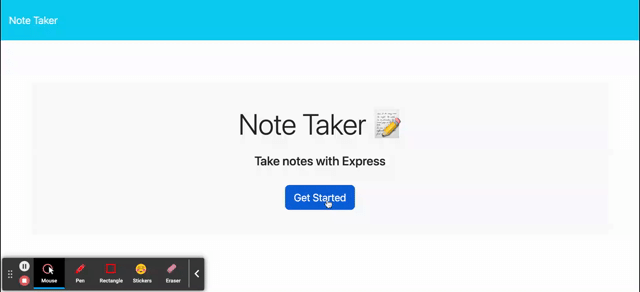

# Note Taker Starter Code

## About
This is an application that will generate a SVG image based on user input.

## Istallation
Installation of express and uuid from npm will be required for this code to work.

## Usage
This code can be used to take and store notes with unique IDs in a database.

## Contributing
Special thanks to Eric Sayer for helping me build this application during our tutoring session.
## License
Open source student project.
## Contact
Brennan Mitchell - @mr_wait_music on twitter or brennanmitchell1192@gmail.com

GitHub- https://github.com/mrwait-music

drive link to video: https://drive.google.com/file/d/1HHBiK6lQAbvVGeh1MFRDxBKDVB2T0S3a/view

